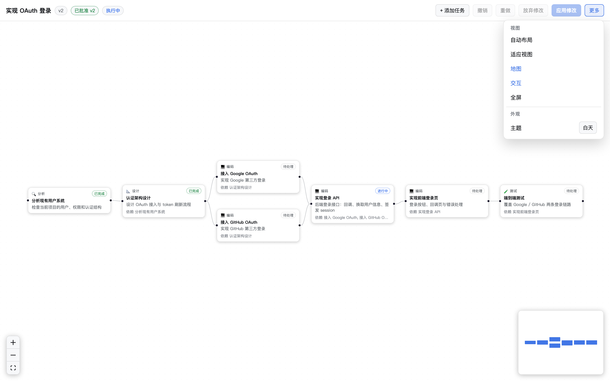

<div align="center">

# dsh-visual-plan

[简体中文](./README.md) · **English**

**Visual Plan mode for [DeepSeek Harness](https://github.com/deepseek-ai/deepseek-harness) (`dsh`)**:
the plan produced by the agent in Plan Mode automatically becomes an editable node graph.
You can drag nodes, rewire dependencies, attach comments, review the Plan Diff,
create a new version, and hand the user-approved revised plan back to DSH for execution.

</div>

## Flow

```text
User request → DSH Plan Mode → structured VisualPlan JSON → node-graph canvas
        → view / edit / comment → Apply Changes → Plan Diff → user confirms
        → new version (v1 → v2 → …) → revised plan written back to DSH → execute
```

## Demo



## Features

- **Automatic plan visualization**: the `exit_plan_mode` output is converted into a VisualPlan JSON
  and rendered with DAG auto-layout (no overlapping nodes, clear dependency flow).
- **Full editing**: add / delete / edit tasks, drag to rewire dependencies; task type and status at a glance.
- **Comments**: attach comments to any task; saved and traceable with each version.
- **Plan Diff**: shows added / removed / modified / dependency changes before commit; nothing is written without confirmation.
- **Versioned storage**: every Apply creates an immutable new version (`.plan/revisions/vN.json`);
  the user-approved plan is never overwritten.
- **Reliable write-back**: the **approved version (Plan vN)** is handed to the agent with an explicit message, and the agent continues from that exact version; if the situation changes during execution, the agent must propose a new plan for approval instead of silently modifying the approved one.
- **Dual data formats**: `plan.json` (machine interface) + `plan.md` (human / agent-readable, Git-friendly, debuggable).
- **Plan ↔ Agent boundary**: `plan.status / version / approvedVersion / executionVersion` — execution is bound to the approved version, laying the foundation for dynamic re-planning.
- **Robustness**: JSON validation, missing-dependency and circular-dependency detection;
  falls back to the Markdown plan when parsing fails.
- **Canvas capabilities**: theme (follow / day / night), minimap toggle, fullscreen, interactivity toggle,
  high-contrast controls in the bottom-left corner.
- **Localization**: 中文 / English, following the DSH Language setting (Chinese by default).
- **Decoupled from DSH core**: UI is isolated from the Agent Core; disabling the plugin leaves DSH's built-in Plan Mode untouched.

## Installation

> Requires DSH `>= 0.1.0-rc.6` (verified against `0.1.0-rc.6`).

### Local directory (development)

```sh
dsh plugin --profile web add /path/to/dsh-visual-plan
```

### GitHub (after publishing)

```sh
dsh plugin --profile web add github:<owner>/dsh-visual-plan
```

> pnpm ≥ 10 refuses to run `prepare` build scripts for Git dependencies on first install.
> Add `dsh-visual-plan` to the profile's `allowBuilds` in `pnpm-workspace.yaml` and retry.

Verify the config layer and restart:

```sh
dsh --profile web --dump-config   # expect a "dsh-visual-plan" layer
dsh --profile web
```

## Usage

1. In the Web GUI (`dsh web`, default `http://127.0.0.1:3080`), open a session, enter Plan Mode, and generate a plan.
2. Switch to the **Visual Plan** tab (between Chat and Trajectory).
3. Edit the graph: drag / zoom / pan the canvas, click a node to open the editor and change title, description,
   type, status, or dependencies; add or delete tasks and attach comments.
4. Click **Apply Changes** and confirm in the Diff dialog.
5. DSH creates a new version and continues execution from the revised plan.

## Architecture

```text
DSH Plan Mode (exit_plan_mode markdown)
        │
        ▼
DeepSeekHarnessAdapter ──► VisualPlan JSON (single machine interface)
        │                              │
        ▼                              ▼
   revised message              React Flow canvas (editable)
        │                              │
        └────────── Apply Changes ◄────┘
                      │
                      ▼
               Plan Diff → user confirms
                      │
                      ▼
        .plan/plan.json + plan.md + revisions/vN.json
                      │
                      ▼
          revised plan back to DSH → execution
```

Module layout:

- `src/schema` — VisualPlan / Task / Edge / Comment / Version types + validation
  (missing dependency, self-dependency, circular-dependency detection).
- `src/engine` — Markdown ⇄ plan conversion, plan diff, version creation.
- `src/adapter` — source-agnostic adapter seam; v1 ships the DSH adapter
  (`exit_plan_mode` → VisualPlan, VisualPlan → revised-plan message).
- `src/index.ts` — host face: `.plan/` persistence and loopback API.
- `src/client` — the Visual Plan tab (React Flow canvas, task editor, comments, Diff dialog, Apply).

## Data layout

Each approved plan is stored in the session workspace:

```text
.plan/
├── plan.json      latest VisualPlan
├── plan.md        latest markdown (agent-readable)
└── revisions/
    ├── v1.json    immutable approved snapshots
    └── v2.json
```

## Version & execution boundary

Every Apply records the new version as both `approvedVersion` and `executionVersion`:

```text
Plan v1 (agent-generated)  reviewing     approvedVersion = null   executionVersion = null
        │ user applies
        ▼
Plan v2 (user-approved)    executing     approvedVersion = 2      executionVersion = 2
        │ later draft v3
        ▼
Plan v3 (new draft)        draft         approvedVersion = 2      executionVersion = 2
```

Execution is always bound to the approved version; a newer draft never silently
replaces the version that is currently being executed.

## Development

```sh
npm install
npm run typecheck   # host + client type checks
npm run build       # host + client build
npm run verify      # offline contract + pure-logic verification (77 checks)
```

## E2E

Against a running DSH web profile that composes this package:

```sh
node scripts/gui-probe.mjs [url]        # tab registration + view mounting
node scripts/e2e-plan-flow.mjs [url]    # /plan → approve → nodes on canvas
```

The full plan-flow script needs a working model and covers the acceptance chain:
Plan Mode → `exit_plan_mode` → VisualPlan → canvas.

## Roadmap & Changelog

- [Roadmap](./ROADMAP.md)
- [Changelog](./CHANGELOG.md)

## Related documents

- [DSH plugin development guide](https://github.com/deepseek-ai/deepseek-harness/blob/master/docs/user/develop/basic/index.md)
- [DSH plugin configuration](https://github.com/deepseek-ai/deepseek-harness/blob/master/docs/user/develop/basic/config.md)
- [DeepSeek Harness](https://github.com/deepseek-ai/deepseek-harness)

## License

[MIT](./LICENSE)
